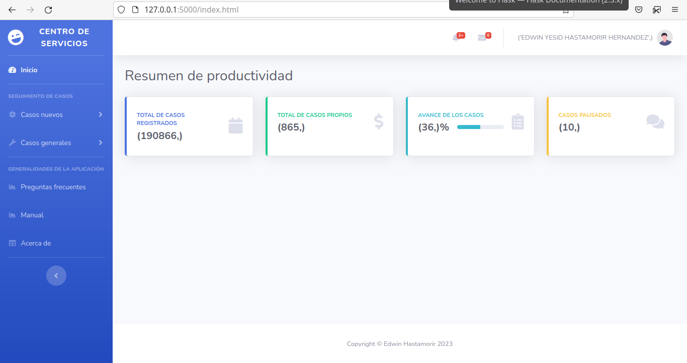

# Centro de servicio 
#### Un ejemplo de uso de Flask conectando a Oracle Database. 

## Screenshots

## Description
Centro de servicio es un proyecto académico que utiliza como base un proyecto estándar en Flask modificando la plantilla en Bootstrap disponible en <a target="_blank" href="https://startbootstrap.com/theme/sb-admin-2">SB Admin 2</a>. Para el almacenamiento de datos se hace uso de una conexión a una base de datos Oracle. Tal conexión se establece utilizando python-oracledb. 

## Comandos utilizados durante la creación del proyecto

### Consideraciones iniciales.

El equipo utilizado tiene instalado OpenSuse Leap 15.4 con python 3.8.16

### Creación del directorio para el proyecto.

``mkdir proyecto ``  
``cd proyecto ``  
``mkdir modelodb ``  
``mkdir centroDeServicio ``  
``cd centroDeServicio ``  
``python3 -m ensurepip --upgrade ``  
``python3 -m venv venv``  
``. venv/bin/activate ``  
``python3 -m pip install --upgrade pip ``  
``pip install flask ``  
``pip install sqlalchemy ``  
``pip install werkzeug ``  
``# pip install cx_Oracle #No se utilizó``  
``pip install oracledb ``  
``mkdir home ``  
``cd home ``  
``vi main.py ``  
``mkdir templates ``  
``cd templates `` 
``vi index.html `` 

### Ejecución del proyecto 
``. venv/bin/activate ``  
``export PYTHON_USERNAME=SPT ``  
``export PYTHON_PASSWORD=SPT ``  
``export PYTHON_CONNECTSTRING="192.168.3.47/C02DB01" ``  
``export FLASK_APP=main.py ``  
``cd home ``  
``flask run ``  

### Rutas a probar 

`` http://127.0.0.1:5000 ``  

